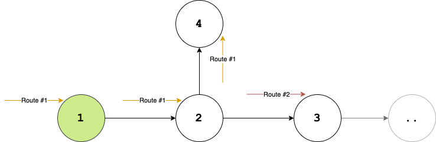
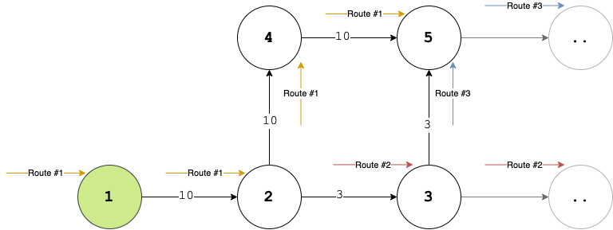
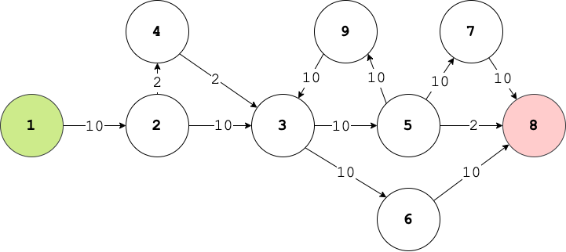

# Path-Finder
Path Finder Algorithm for Network Graph

## Prerequisites

Path-Finder is written in Python 3 and no external library needed.

## The Algorithm

### Data Structure

This project based on  these 4 class; _Container_, _Node_, _Route_, and _main_.

_Container_ is a singleton and responsible to create and store _Node_ objects.

_Node_ objects represents unique node on the graph. It stores _route_ objects that visited the node itself.
It also evaluates the route with the minimum distance.

_Route_ objects are representing the path that are unique. It contains path data with related _node_ objects.

### Process

For path finding algorithm there are a few well-known algorithm. But in this project I aimed to develop a new approach.

This project has 3 main feature:

1. Divide and Conquer
2. Simplifier
3. Infinite Loop Detection

#### 1. Divide amd Conquer

It is the main approach of this path-finder algorithm. When a node has more than one edge, It duplicates the arrived route as much as edge count.
<br><br><br>

<br><br><br>

##### Route and Path Changes Related to Time
```
T       Route       Path (Visited Nodes)

0       Route #1    -

1       Route #1    1

2       Route #1    1, 2

3       Route #1    1, 2, 4
        Route #2    1, 2, 3

```

### 2. Simplifier

If a node have more than one arrived _route_, it removes all routes but the shortest distance.
Thus, it prevents the parabolic rise of number of _route_ objects and increases the performance.

<br><br><br>

<br><br><br>

As shown in the graph, at the _Node 5_, _Route #1_ and _Route #3_ arrived. _Route #1_ has been deleted because _Route #3_ travels a shorter distance.
Another important issue in this section is that Route #1 and Route #3 do **not have to reach the _Node 5_ at the same time**. Even if they arrive in different time zones, the related Route is deleted.

##### Route and Path Changes Related to Time

```
T       Route       Path (Visited Nodes)

.
.
        
4       Route #1    1, 2, 4, 5
        Route #2    1, 2, 3, ..
        Route #3    1, 2, 3, 5

5       Route #1    (Removed)
        Route #2    1, 2, 3, ..
        Route #3    1, 2, 3, 5, ..
```

### 3. Infinite Loop Detection

Avoiding infinite loops was an important part of the project. Therefore, each route object contains a list of nodes it has passed through before. Thus, the Route object is deleted when the same node is visited again.

## Usage

You can call `run.sh` with _File Path_, _Initial Node ID_ and _Target Node ID_ parameters. 

### Linux

```bash
./run.sh basic.txt 1 8
```

### MacOS

```bash
bash run.sh basic.txt 1 8
```

## Sample Graph

There are two samples under the `files/sample` directory.

Here is the visual of the network graph that sample.txt represent:
<br><br><br>

<br><br><br>

#### Calling Path Finder with Sample Data
```bash
bash run.sh file/sample/basic.txt 1 8
```

#### Solution
```bash
26
```

## License
[MIT](https://choosealicense.com/licenses/mit/)
